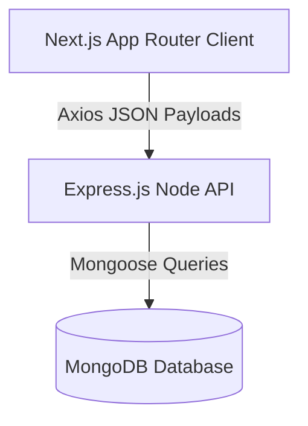
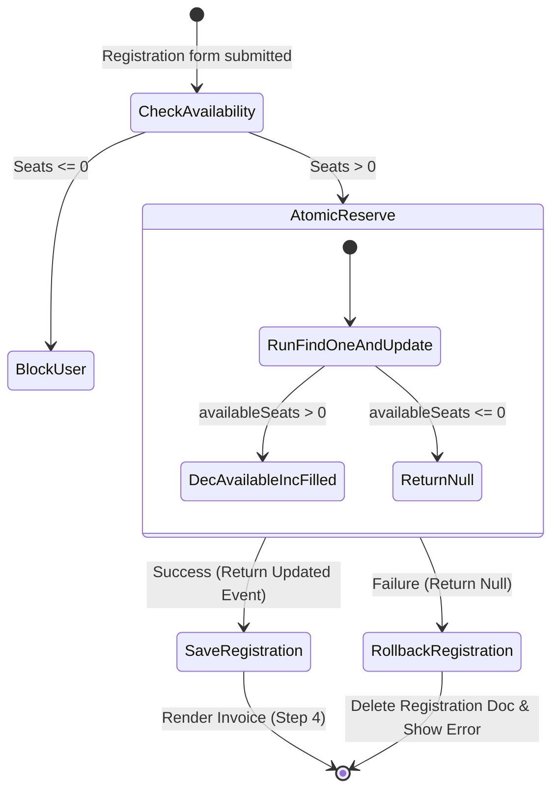
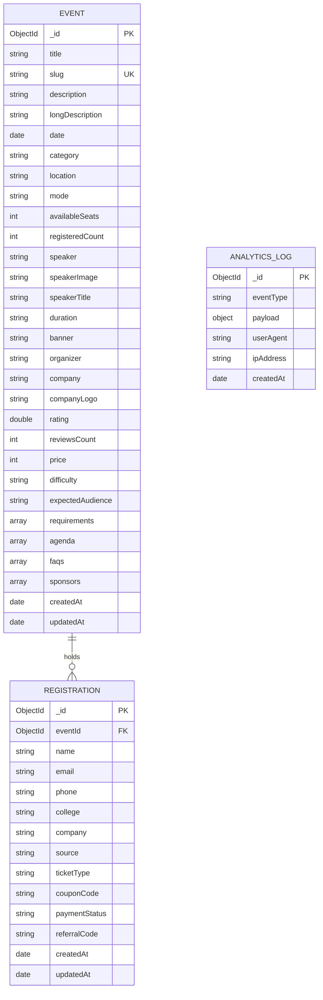

# Architecture Blueprint 🏗️

This document outlines the system architecture, database relations, and engineering decisions implemented in **BharatEvents**.

---

## 1. High-Level Architectural Flow

BharatEvents is architected as a decoupled, monorepo-style system:



---

## 2. Component Hierarchies

### Frontend Page Routing
Next.js utilizes dynamic file-based routing:
*   `/` (Explore Listings)
*   `/events/[slug]` (Dynamic details & registration wizard)
*   `/admin/dashboard` (Passphrase locked stats, SVGs, ledger)

### Reusable UI Layer
*   **QueryProvider**: Standardizes TanStack Query configurations across client trees.
*   **Navbar & Footer**: Standardized navigation layouts.
*   **Modal**: Lock scroll viewport, overlay backgrounds, and exit animations.
*   **EventCardSkeleton**: Tailwind pulse loaders showing skeleton layouts during API loads.
*   **EmptyState**: Visual graphics prompting filter resets.

---

## 3. Concurrency & Race-Condition Guards

To prevent overallocating seats during high-traffic bookings, we implemented an atomic seat guard:



1.  **Zod validation**: Express parses requests using Zod schemas.
2.  **Duplicate check**: Queries unique registration entries to reject duplicate submissions.
3.  **Atomic Update**:
    ```typescript
    const updatedEvent = await Event.findOneAndUpdate(
      { _id: id, availableSeats: { $gt: 0 } },
      { $inc: { availableSeats: -1, registeredCount: 1 } },
      { new: true }
    );
    ```
    If another request decrements `availableSeats` to 0, this update fails, returning `null`.
4.  **Rollback**: The controller immediately catches the null result, deletes the registration log, and returns an error response.

---

## 4. Database Schema Relations


