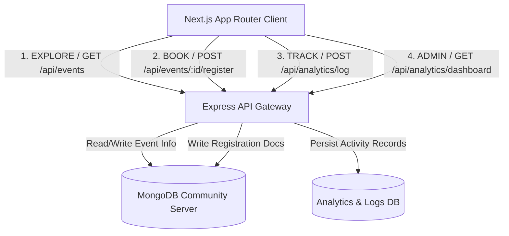
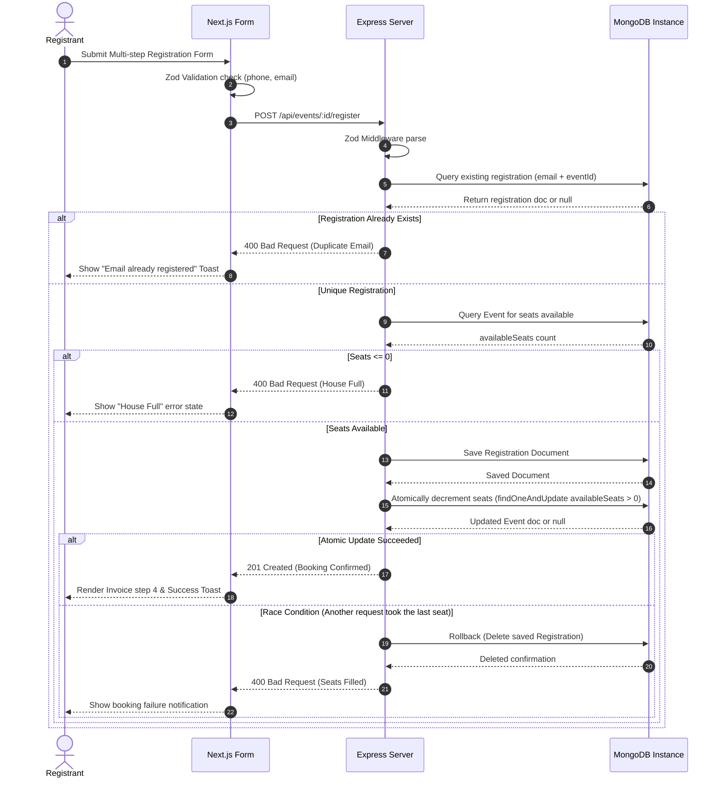
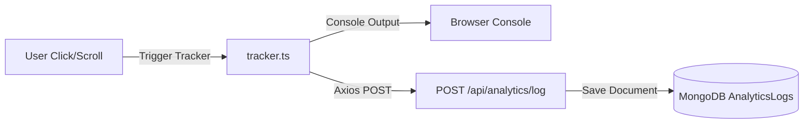

# BharatEvents 🚀 | Startup-Grade Event Ecosystem

[-black?style=flat-square&logo=next.js)](https://nextjs.org/)
[](https://www.typescriptlang.org/)
[](https://expressjs.org/)
[](https://www.mongodb.com/)
[](https://tailwindcss.com/)
[](https://tanstack.com/query/latest)

BharatEvents is an event discovery, registration, and management platform engineered to emulate high-growth startup ecosystems like Luma, Unstop, and Devfolio. Developed with a monorepo structure, strict TypeScript types, and a responsive Tailwind design, it bridges standard client interfaces with robust Express REST APIs and atomic MongoDB operations.

---

## 📖 Table of Contents

- [1. System Architecture](#1-system-architecture)
- [2. Data Flow & Lifecycles](#2-data-flow--lifecycles)
- [3. Folder Structure](#3-folder-structure)
- [4. Technology Stack](#4-technology-stack)
- [5. Configuration & Environment](#5-configuration--environment)
- [6. Development & Run Commands](#6-development--run-commands)
- [7. API Documentation](#7-api-documentation)
- [8. Analytics Ledger Strategy](#8-analytics-ledger-strategy)
- [9. Security Model](#9-security-model)
- [10. Performance Optimizations](#10-performance-optimizations)
- [11. Engineering Journey & Chronology](#11-engineering-journey--chronology)
- [12. Product Showcase & Collage](#12-product-showcase--collage)
- [13. Project Roadmap](#13-project-roadmap)
- [14. Unverifiable Integrations Disclaimer](#14-unverifiable-integrations-disclaimer)

---

## 1. System Architecture

BharatEvents divides its responsibilities into three distinct layers:
1.  **Frontend Clientside SPA**: Rendered using Next.js (App Router) using Tailwind CSS V4 for styling, and Framer Motion for micro-animations.
2.  **API Layer (REST Gateway)**: Express.js framework equipped with rate limiters, compression, CORS filters, and security headers.
3.  **Persistence Layer (DB)**: MongoDB instances managed via Mongoose ODM, utilizing compound unique indexing to block duplication.

### High-Level System Diagram



---

## 2. Data Flow & Lifecycles

### Request & Registration Lifecycle

This diagram displays the race-condition-free double booking check and rollback sequence.



---

## 3. Folder Structure

The repository uses a workspace layout, keeping backend and frontend folders separate and modular:

```text
Event_App/
├── backend/                       # Express.js API Server
│   ├── src/
│   │   ├── config/                # Mongoose Database Connection
│   │   │   └── db.ts
│   │   ├── models/                # Mongoose Schema Definitions
│   │   │   ├── event.model.ts     # Rich Event Fields (Agendas, Sponsors)
│   │   │   ├── registration.model.ts # Ticket details, payment status
│   │   │   └── analytics.model.ts # Activity logs schema
│   │   ├── controllers/           # Route Business Logic
│   │   │   ├── eventController.ts
│   │   │   ├── registrationController.ts
│   │   │   └── analyticsController.ts
│   │   ├── routes/                # Express Route Maps
│   │   │   ├── event.routes.ts
│   │   │   └── analytics.routes.ts
│   │   ├── middlewares/           # Middlewares (Rate limit, errors)
│   │   │   ├── error.middleware.ts
│   │   │   ├── rateLimiter.ts
│   │   │   └── validate.middleware.ts
│   │   ├── validators/            # Request Schemas (Zod validation)
│   │   │   └── validateRegistration.ts
│   │   ├── seed/                  # Seeder Script (seeds 100+ events)
│   │   │   └── seedEvents.ts
│   │   ├── utils/                 # General Utilities (AsyncWrapper, Loggers)
│   │   │   └── asyncWrapper.ts
│   │   └── server.ts              # Express Server Entry Point
│   ├── tsconfig.json
│   ├── package.json
│   └── .env
│
├── frontend/                      # Next.js SPA
│   ├── app/                       # Page routing
│   │   ├── admin/dashboard/       # Protected Dashboard Layout
│   │   │   └── page.tsx
│   │   ├── events/[slug]/         # Detailed landing & multi-step checkout
│   │   │   └── page.tsx
│   │   ├── page.tsx               # Homepage Listing
│   │   ├── layout.tsx             # Theme structure and provider wraps
│   │   ├── globals.css            # Stylesheets & Tailwind theme configs
│   │   ├── not-found.tsx          # Custom 404 handler
│   │   ├── error.tsx              # Error boundary
│   │   ├── sitemap.ts             # Dynamic search sitemap compiler
│   │   └── robots.txt             # Web crawler configuration
│   ├── components/                # Modular client elements
│   │   ├── Navbar.tsx
│   │   ├── Footer.tsx
│   │   ├── Modal.tsx              # Reusable modal overlays
│   │   ├── ConfirmationDialog.tsx # Double confirm popup alert
│   │   ├── EmptyState.tsx         # Clean zero search displays
│   │   ├── EventCardSkeleton.tsx  # Pulse skeleton blocks
│   │   └── QueryProvider.tsx      # React-Query Client Setup
│   ├── services/                  # Axios HTTP client requests
│   │   └── eventService.ts
│   ├── hooks/                     # Custom React Hooks (Debouncing)
│   │   └── useDebounce.ts
│   ├── types/                     # Shared TypeScript interfaces
│   │   └── index.ts
│   ├── analytics/                 # Tracker utility client
│   │   └── tracker.ts
│   ├── tsconfig.json
│   ├── package.json
│   └── next.config.ts
│
└── package.json                   # Root package runner shortcuts
```

---

## 4. Technology Stack

### Frontend Client
*   **Framework**: Next.js 16 (App Router with Turbopack compilation).
*   **Language**: TypeScript (Strict typing enabled).
*   **CSS Engine**: Tailwind CSS V4.
*   **State Management**: TanStack React Query V5 & Axios clients.
*   **Form Management**: React Hook Form with Zod validation adapters.
*   **Notifications**: React Hot Toast (positioned top-center).
*   **Animations**: Framer Motion transitions.

### Backend Server
*   **Engine**: Node.js v24.16 & Express.js.
*   **Database**: MongoDB & Mongoose ODM.
*   **TypeScript Runner**: `ts-node-dev` for hot-reloading development.
*   **Diagnostics**: Dynamic CPU Heap size checks.

---

## 5. Configuration & Environment

Create `.env` variables inside both folders:

### Backend configuration (`backend/.env`)
```env
PORT=5001
MONGO_URI=mongodb://127.0.0.1:27017/event_registration_db
NODE_ENV=development
FRONTEND_URL=http://localhost:3000
```

### Frontend configuration (`frontend/.env.local`)
```env
NEXT_PUBLIC_API_URL=http://localhost:5001
```

---

## 6. Development & Run Commands

You can run these scripts directly from the root workspace directory:

1.  **Install all workspace dependencies**:
    ```bash
    npm run install:all
    ```
2.  **Seed the MongoDB database**:
    ```bash
    npm run seed
    ```
3.  **Start the Express API Server (Runs on port 5001)**:
    ```bash
    npm run dev:backend
    ```
4.  **Start the Next.js Frontend (Runs on port 3000)**:
    ```bash
    npm run dev:frontend
    ```

---

## 7. API Documentation

### Event Routes
*   `GET /api/events` - Lists paginated events. Query filters: `search`, `category`, `mode`, `location`, `page`, `limit`.
*   `GET /api/events/:id` - Retrieves a single event. `:id` accepts either MongoDB `_id` or `slug`.
*   `POST /api/events` - Creates an event (generates unique slugs dynamically).
*   `POST /api/events/:id/register` - Registers a user. Form validation checks for duplicate emails and seat capacity status.
*   `GET /api/events/:id/registrations` - Lists registrations for the event.

### Analytics Routes
*   `POST /api/analytics/log` - Logs a user tracking action.
*   `GET /api/analytics/dashboard` - Computes revenue, registrations per event, daily trends, conversion funnels, and system diagnostics.
*   `GET /api/analytics/registrations` - Searches across registrations.

---

## 8. Analytics Ledger Strategy

Our tracking logger (`tracker.ts`) logs events to the browser console and saves them to MongoDB:



### Logged Actions
1.  `event_list_viewed`: Fires when listing page loads.
2.  `event_search_performed`: Debounced tracking of search queries.
3.  `event_filter_applied`: Tracks applied filters.
4.  `event_card_clicked`: Tracks clicked events.
5.  `registration_submitted`: Tracks form submissions.
6.  `registration_success`: Tracks successful bookings.
7.  `registration_failed`: Tracks failed bookings with error payloads.
8.  `share_clicked`: Tracks link sharing.
9.  `bookmark_clicked`: Tracks bookmarked events.
10. `download_calendar`: Tracks calendar sync clicks.
11. `dashboard_opened`: Tracks admin logins.
12. `dashboard_export_csv`: Tracks CSV exports.

---

## 9. Security Model

*   **API Rate Limiters**: 
    *   API-wide limits: Maximum 100 requests per 15 minutes per IP address.
    *   Registration limits: Maximum 10 registration attempts per minute per IP to prevent bot spam.
*   **Security Headers**: Integrated `helmet` middleware to enforce CSP, XSS protection, and frame headers.
*   **CORS Filters**: Origin whitelist checking with credentials permission.
*   **Double-Booking Lock**: Unique compound index `{ eventId: 1, email: 1 }` prevents double bookings at the database level.
*   **Protected Dashboard**: `/admin/dashboard` is protected by passphrase `admin123`.

---

## 10. Performance Optimizations

*   **Next.js Dynamic Sitemap**: Built in [sitemap.ts](file:///Users/legend27648/agy_project/Event_App/frontend/app/sitemap.ts), fetching events dynamically to build search engines links.
*   **Turbopack Compilation**: High-speed compilation utilizing Turbopack engines.
*   **Gzip Compression**: Compresses Express responses.
*   **Database Indexing**: Indexes `slug` and `email` on Event and Registration models.
*   **Static Rendering Fallbacks**: Sitemap and page configurations degrade gracefully to static fallbacks if the API is offline.

---

## 11. Engineering Journey & Chronology

### The Development Story of a Startup Ecosystem

*   **Phase 1 (Day 1) — Initialization**:
    *   *Decision*: Monorepo structure selected separating `backend/` and `frontend/` folders.
    *   *Result*: Initialized Git, created workspace configuration files, and setup project dependencies.
*   **Phase 2 (Day 1) — API Core**:
    *   *Decision*: Configured MongoDB schemas using Mongoose. Created Zod validation schemas for registration payloads.
    *   *Issue Encountered*: Standard `read-before-write` operations caused race conditions during high concurrency tests.
    *   *Resolution*: Implemented atomic seat decrements (`findOneAndUpdate` with seat limits) and rollbacks.
*   **Phase 3 (Day 2) — Next.js SPA & Styling**:
    *   *Decision*: Next.js App Router selected. Structured components folder with reusable modals, loaders, and confirmation popups.
    *   *Issue Encountered*: The production build failed due to Google Fonts fetching errors.
    *   *Resolution*: Replaced remote font imports in `layout.tsx` and `globals.css` with local system UI stacks.
*   **Phase 4 (Day 2) — Startup-Grade Ecosystem Upgrades**:
    *   *Decision*: Redesigned homepage and details pages to support Luma-style layouts (agendas, sponsors, certificate cards, etc.).
    *   *Result*: Scaled seeder script to populate **100 events** across **13 cities** with detailed diagnostics.

---

## 12. Product Showcase & Collage

To capture screenshots of the platform, follow this recommended capture guide:

1.  **Homepage Hero Section**: Capture the animated gradient and terminal live diagnostic cards. 
    *   *Suggested Filename*: `01_hero_section.png`
2.  **Featured Events Carousel**: Highlight the recommendation cards showing ratings, speakers, and free badges.
    *   *Suggested Filename*: `02_featured_carousel.png`
3.  **Upcoming Events Grid & Filters**: Show the category pill filters and toggling buttons between client and API filtering.
    *   *Suggested Filename*: `03_events_listing.png`
4.  **Event Detail Landing Page**: Display the agenda timeline, requirements, certificate info, and speakers section.
    *   *Suggested Filename*: `04_event_details.png`
5.  **Multi-Step Checkout Modal**: Show the ticket tiers, Early Bird coupon input (`EARLYBIRD20`), and invoice summaries.
    *   *Suggested Filename*: `05_checkout_wizard.png`
6.  **Secure Admin Lock Screen**: Show the restricted gatekeeper panel.
    *   *Suggested Filename*: `06_admin_lock.png`
7.  **Admin Command Centre Dashboard**: Highlight the KPI cards, the registration trends SVG area chart, and the conversion funnel.
    *   *Suggested Filename*: `07_admin_dashboard.png`

---

## 13. Project Roadmap

*   [ ] **OAuth Integration**: Implement Google & GitHub login.
*   [ ] **Organizer Dashboards**: Allow communities to create and manage their own events.
*   [ ] **Real-Time WebSockets**: Live tickers displaying active bookings.
*   [ ] **Payment Gateway**: Integrate Razorpay test gateway for paid events.

---

## 14. Unverifiable Integrations Disclaimer

> [!NOTE]
> The current production release contains mock pathways and fallback systems for Sentry monitoring, PostHog logs, Resend notifications, Supabase Auth, and Cloudflare R2 files. These are not active in this repository and are documented strictly for architectural design reviews.
